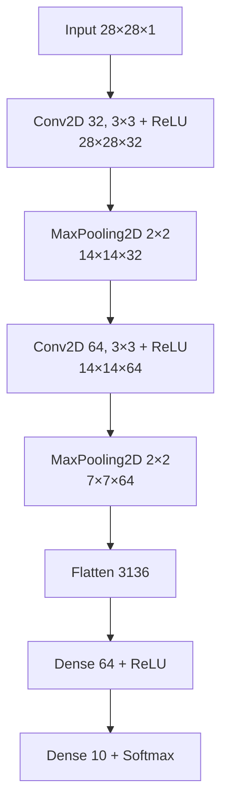
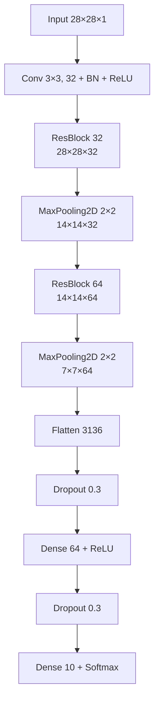
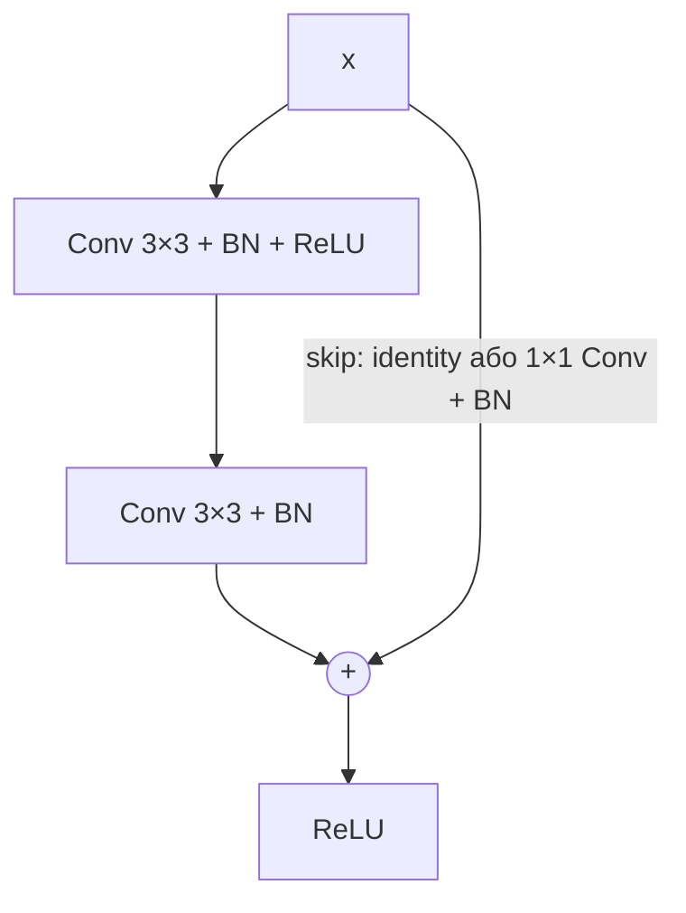

# Схеми архітектур

## Базова CNN (пп. 2-3), 220 234 параметри

```mermaid
flowchart TD
    A["Input 28×28×1"] --> B["Conv2D 32, 3×3 + ReLU<br/>28×28×32"]
    B --> C["MaxPooling2D 2×2<br/>14×14×32"]
    C --> D["Conv2D 64, 3×3 + ReLU<br/>14×14×64"]
    D --> E["MaxPooling2D 2×2<br/>7×7×64"]
    E --> F["Flatten 3136"]
    F --> G["Dense 64 + ReLU"]
    G --> H["Dense 10 + Softmax"]
```

## Удосконалена CNN з ResNet-блоками (п. 6), 278 634 параметри

```mermaid
flowchart TD
    A["Input 28×28×1"] --> B["Conv 3×3, 32 + BN + ReLU"]
    B --> C["ResBlock 32<br/>28×28×32"]
    C --> D["MaxPooling2D 2×2<br/>14×14×32"]
    D --> E["ResBlock 64<br/>14×14×64"]
    E --> F["MaxPooling2D 2×2<br/>7×7×64"]
    F --> G["Flatten 3136"]
    G --> H["Dropout 0.3"]
    H --> I["Dense 64 + ReLU"]
    I --> J["Dropout 0.3"]
    J --> K["Dense 10 + Softmax"]
```

## Залишковий блок

```mermaid
flowchart TD
    X["x"] --> C1["Conv 3×3 + BN + ReLU"]
    C1 --> C2["Conv 3×3 + BN"]
    C2 --> ADD(("+"))
    X -->|"skip: identity або 1×1 Conv + BN"| ADD
    ADD --> R["ReLU"]
```